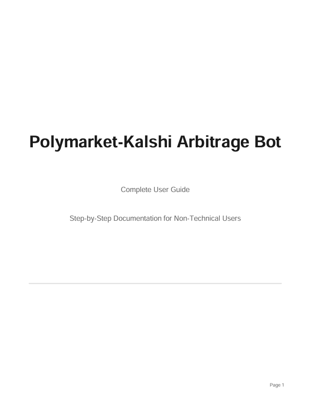

# Polymarket-Kalshi Arbitrage Bot

A high-performance, production-ready arbitrage trading system for cross-platform prediction markets. Automatically detects and executes arbitrage opportunities between Kalshi and Polymarket with sub-millisecond latency.

<div align="center">

[](https://opensource.org/licenses/MIT)
[](https://www.rust-lang.org/)

</div>

---

## Overview

This arbitrage bot exploits price inefficiencies across prediction market platforms by simultaneously purchasing complementary outcomes (YES/NO) when their combined cost is less than the guaranteed $1.00 payout. The system features:

- **Real-time monitoring** via WebSocket connections to both platforms
- **Sub-millisecond arbitrage detection** using SIMD-accelerated algorithms
- **Concurrent order execution** with automatic position reconciliation
- **Comprehensive risk management** including circuit breakers and position limits
- **Full trade history tracking** with SQLite database and analytics tools
- **Beginner-friendly** with extensive documentation for non-technical users

---

## Documentation

**Complete setup and usage documentation is available in the [`doc/`](./doc/) folder.**



### Quick Links

1. [**Getting Started Guide**](./doc/01-getting-started.md) - System overview and prerequisites
2. [**Installation Guide**](./doc/02-installation.md) - Platform-specific installation (Windows/Mac/Linux)
3. [**Credentials Setup**](./doc/03-credentials.md) - API key configuration for both platforms
4. [**Configuration Guide**](./doc/04-configuration.md) - Environment variables and advanced settings
5. [**Running the Bot**](./doc/05-running-the-bot.md) - Operational procedures and monitoring
6. [**Troubleshooting**](./doc/06-troubleshooting.md) - Common issues and solutions

**PDF Version:** [Complete User Guide (PDF)](./doc/Polymarket-Kalshi-Arbitrage-Bot-User-Guide.pdf)

---

## Features

### Core Functionality

- **Cross-Platform Arbitrage**: Kalshi ↔ Polymarket and same-platform opportunities
- **Real-Time Price Feeds**: WebSocket connections for instant market updates
- **Atomic Orderbook Cache**: Lock-free data structures for zero-copy updates
- **SIMD Acceleration**: Parallel arbitrage detection across multiple markets
- **Concurrent Execution**: Simultaneous order placement on both platforms
- **Automatic Reconciliation**: Position balancing for mismatched fills

### Risk Management

- **Circuit Breaker System**: Configurable limits for positions, losses, and errors
- **Position Tracking**: Real-time P&L and exposure monitoring
- **Dry-Run Mode**: Paper trading for testing without capital risk
- **Fee Optimization**: Automatic fee calculation and profit validation

### Data & Analytics

- **SQLite Database**: Persistent storage of all trading activity
- **Trade Analytics**: Performance metrics, success rates, and execution statistics
- **CSV Export**: Data export for external analysis
- **Historical Queries**: Comprehensive reporting on trades and opportunities

---

## Quick Start

### 1. Install Dependencies

```bash
# Rust 1.75+
curl --proto '=https' --tlsv1.2 -sSf https://sh.rustup.rs | sh

# Navigate to project directory
cd prediction-market-arbitrage  # or your project directory name

# Build
cargo build --release
```

 **Detailed installation guide:** [Installation Guide](./doc/02-installation.md)

### 2. Set Up Credentials

Create a `.env` file:

```bash
# === KALSHI CREDENTIALS ===
KALSHI_API_KEY_ID=your_kalshi_api_key_id
KALSHI_PRIVATE_KEY_PATH=/path/to/kalshi_private_key.pem

# === POLYMARKET CREDENTIALS ===
POLY_PRIVATE_KEY=0xYOUR_WALLET_PRIVATE_KEY
POLY_FUNDER=0xYOUR_WALLET_ADDRESS

# === BOT CONFIGURATION ===
DRY_RUN=1
RUST_LOG=info
```

 **Complete credentials setup guide:** [Getting Your Credentials](./doc/03-credentials.md) | [Configuration Setup](./doc/04-configuration.md)

### 3. Run

```bash
# Dry run (paper trading)
dotenvx run -- cargo run --release

# Live execution
DRY_RUN=0 dotenvx run -- cargo run --release
```

 **Running the bot guide:** [Running the Bot](./doc/05-running-the-bot.md)

---

##  Documentation

>  **CRITICAL: Before Starting - Read the Documentation!**
> 
> **This README provides a quick overview. For complete setup instructions, troubleshooting, and detailed explanations, you MUST refer to the comprehensive documentation in the [`doc/`](./doc/) folder. All guides are designed for beginners with no coding experience.**

**Follow these comprehensive guides in order:**

1. **[ Getting Started Guide](./doc/01-getting-started.md)** - Overview and introduction - **START HERE!**
2. **[ Installation Guide](./doc/02-installation.md)** - Install Rust and dependencies (Windows/Mac/Linux)
3. **[ Getting Your Credentials](./doc/03-credentials.md)** - Get API keys from Kalshi and Polymarket
4. **[ Configuration Setup](./doc/04-configuration.md)** - Complete guide to all configuration options
5. **[ Running the Bot](./doc/05-running-the-bot.md)** - Start and monitor your bot
6. **[ Troubleshooting](./doc/06-troubleshooting.md)** - Common problems and solutions

 **PDF Version:** A complete PDF guide combining all documentation: **[ Download Polymarket-Kalshi-Arbitrage-Bot-User-Guide.pdf](./doc/Polymarket-Kalshi-Arbitrage-Bot-User-Guide.pdf)**

**Why refer to the documentation?**
-  Step-by-step instructions for every step
-  Screenshots and visual guides
-  Troubleshooting for common issues
-  Configuration explanations
-  Safety warnings and best practices
-  Written specifically for non-technical users

---

## Environment Variables

### Required

| Variable | Description |
|----------|-------------|
| `KALSHI_API_KEY_ID` | Your Kalshi API key ID |
| `KALSHI_PRIVATE_KEY_PATH` | Path to RSA private key (PEM format) for Kalshi API signing |
| `POLY_PRIVATE_KEY` | Ethereum private key (with 0x prefix) for Polymarket wallet |
| `POLY_FUNDER` | Your Polymarket wallet address (with 0x prefix) |

### Bot Configuration

| Variable | Default | Description |
|----------|---------|-------------|
| `DRY_RUN` | `1` | `1` = paper trading (no orders), `0` = live execution |
| `RUST_LOG` | `info` | Log level: `error`, `warn`, `info`, `debug`, `trace` |
| `FORCE_DISCOVERY` | `0` | `1` = re-fetch market mappings (ignore cache) |
| `PRICE_LOGGING` | `0` | `1` = verbose price update logging |

### Test Mode

| Variable | Default | Description |
|----------|---------|-------------|
| `TEST_ARB` | `0` | `1` = inject synthetic arb opportunity for testing |
| `TEST_ARB_TYPE` | `poly_yes_kalshi_no` | Arb type: `poly_yes_kalshi_no`, `kalshi_yes_poly_no`, `poly_same_market`, `kalshi_same_market` |

### Circuit Breaker

| Variable | Default | Description |
|----------|---------|-------------|
| `CB_ENABLED` | `true` | Enable/disable circuit breaker |
| `CB_MAX_POSITION_PER_MARKET` | `100` | Max contracts per market |
| `CB_MAX_TOTAL_POSITION` | `500` | Max total contracts across all markets |
| `CB_MAX_DAILY_LOSS` | `5000` | Max daily loss in cents before halt |
| `CB_MAX_CONSECUTIVE_ERRORS` | `5` | Consecutive errors before halt |
| `CB_COOLDOWN_SECS` | `60` | Cooldown period after circuit breaker trips |

 **Detailed configuration guide:** [Configuration Setup](./doc/04-configuration.md)

---

## Obtaining Credentials

### Kalshi

1. Log in to [Kalshi](https://kalshi.com)
2. Go to **Settings → API Keys**
3. Create a new API key with trading permissions
4. Download the private key (PEM file)
5. Note the API Key ID

### Polymarket

1. Create or import an Ethereum wallet (MetaMask, etc.)
2. Export the private key (include `0x` prefix)
3. Fund your wallet on Polygon network with USDC
4. The wallet address is your `POLY_FUNDER`

 **Step-by-step credentials guide:** [Getting Your Credentials](./doc/03-credentials.md)

---

## Trading History & Analytics

The system includes a comprehensive SQLite database that automatically records all trading activity, providing persistent storage and advanced analytics capabilities.

### Query Interface

```bash
# View recent trading activity
cargo run --bin trading_history

# Display today's performance summary
cargo run --bin trading_history summary

# Generate all-time statistics
cargo run --bin trading_history stats

# Export complete trade history to CSV
cargo run --bin trading_history export
```

### Analytics Features

- **Complete Trade Logging**: Every fill recorded with timestamp, price, size, and fees
- **Opportunity Tracking**: All detected arbitrage opportunities (executed and missed)
- **Performance Metrics**: Success rates, execution latency, and profit statistics
- **Time-Series Analysis**: Daily, weekly, and monthly performance summaries
- **Data Export**: CSV format compatible with Excel, Python, and R
- **SQL Access**: Direct database queries for custom analysis

**Documentation:** Detailed usage instructions available in `README_DATABASE.md`

---

## Usage Examples

### Paper Trading (Development)

```bash
# Full logging, dry run
RUST_LOG=debug DRY_RUN=1 dotenvx run -- cargo run --release
```

### Test Arbitrage Execution

```bash
# Inject synthetic arb to test execution path
TEST_ARB=1 DRY_RUN=0 dotenvx run -- cargo run --release
```

### Production

```bash
# Live trading with circuit breaker
DRY_RUN=0 CB_MAX_DAILY_LOSS=10000 dotenvx run -- cargo run --release
```

### Force Market Re-Discovery

```bash
# Clear cache and re-fetch all market mappings
FORCE_DISCOVERY=1 dotenvx run -- cargo run --release
```

---

## Arbitrage Methodology

### Market Mechanics

Prediction markets guarantee that complementary outcomes sum to $1.00 (YES + NO = $1.00). This fundamental property creates arbitrage opportunities when:

```
Best YES ask (Platform A) + Best NO ask (Platform B) < $1.00
```

### Execution Example

```
Kalshi YES ask:     $0.42
Polymarket NO ask:  $0.56
──────────────────────────
Total acquisition:  $0.98
Guaranteed payout:  $1.00
Risk-free profit:   $0.02 per contract pair
```

The system continuously monitors all available markets across both platforms, detecting these inefficiencies in real-time and executing trades within microseconds of discovery.

### Four Arbitrage Types

| Type | Buy | Sell |
|------|-----|------|
| `poly_yes_kalshi_no` | Polymarket YES | Kalshi NO |
| `kalshi_yes_poly_no` | Kalshi YES | Polymarket NO |
| `poly_same_market` | Polymarket YES + NO | (rare) |
| `kalshi_same_market` | Kalshi YES + NO | (rare) |

### Fee Handling

- **Kalshi:** `ceil(0.07 × contracts × price × (1-price))` - factored into arb detection
- **Polymarket:** Zero trading fees

---

## Architecture

```
src/
├── main.rs              # Entry point, WebSocket orchestration
├── types.rs             # MarketArbState
├── execution.rs         # Concurrent leg execution, in-flight deduplication
├── position_tracker.rs  # Channel-based fill recording, P&L tracking
├── circuit_breaker.rs   # Risk limits, error tracking, auto-halt
├── discovery.rs         # Kalshi↔Polymarket market matching
├── cache.rs             # Team code mappings (EPL, NBA, etc.)
├── kalshi.rs            # Kalshi REST/WS client
├── polymarket.rs        # Polymarket WS client
├── polymarket_clob.rs   # Polymarket CLOB order execution
└── config.rs            # League configs, thresholds
```

### Technical Highlights

- **Lock-Free Architecture**: Atomic operations for zero-copy orderbook updates
- **SIMD Optimization**: Parallel computation achieving sub-millisecond arbitrage detection
- **Concurrent Execution**: Asynchronous order placement across multiple platforms
- **Intelligent Caching**: Market discovery with incremental updates and persistence
- **Risk Management**: Multi-layered protection including circuit breakers and position limits

---

## Development

### Run Tests

```bash
cargo test
```

### Enable Profiling

```bash
cargo build --release --features profiling
```

### Benchmarks

```bash
cargo bench
```

---

## Implementation Status

### Production Features

- ✅ Kalshi REST API and WebSocket client
- ✅ Polymarket REST API and WebSocket client
- ✅ Lock-free atomic orderbook cache
- ✅ SIMD-accelerated arbitrage detection
- ✅ Concurrent multi-platform order execution
- ✅ Real-time position and P&L tracking
- ✅ SQLite trade history database
- ✅ Comprehensive analytics and reporting
- ✅ Circuit breaker risk management
- ✅ Intelligent market discovery with caching
- ✅ Complete documentation suite

### Planned Enhancements

- Configuration management interface
- Multi-account portfolio support
- Advanced order routing algorithms
- Enhanced performance analytics dashboard
- Machine learning integration for opportunity prediction

###  Roadmap

Additional trading systems with advanced strategies are currently in development. These will feature enhanced algorithmic trading capabilities and sophisticated market analysis tools. For updates and inquiries, contact via Telegram: [@mistKail](https://t.me/mistKail)

---

## Supported Markets

The system monitors prediction markets across multiple professional sports leagues:

| Sport | Leagues |
|-------|---------|
| **Soccer** | English Premier League, Bundesliga, La Liga, Serie A, Ligue 1, UEFA Champions League, UEFA Europa League, EFL Championship |
| **Basketball** | NBA |
| **American Football** | NFL, NCAAF |
| **Hockey** | NHL |
| **Baseball** | MLB |
| **Soccer (Americas)** | MLS |

Market coverage includes moneyline, spread, total, and both-teams-to-score (BTTS) market types where available on both platforms.

---

## Troubleshooting

For operational issues, consult the **[Troubleshooting Guide](./doc/06-troubleshooting.md)** which covers:

- Platform-specific installation procedures
- API credential configuration errors
- Runtime and execution issues
- Network connectivity problems
- Performance optimization

### Common Issues

| Error | Resolution |
|-------|------------|
| `cargo: command not found` | Install Rust toolchain - see [Installation Guide](./doc/02-installation.md) |
| `KALSHI_API_KEY_ID not set` | Configure environment variables - see [Configuration Guide](./doc/04-configuration.md) |
| `No market pairs found` | Force discovery refresh or check market hours - see [Troubleshooting Guide](./doc/06-troubleshooting.md) |
| No trade execution | Verify `DRY_RUN=0` and circuit breaker thresholds |

For unresolved issues, contact technical support: [@mistKail](https://t.me/mistKail)

---

## Risk Disclosure & Safety

**Important Notices:**

- **Testing Required:** Always begin with `DRY_RUN=1` to validate configuration without capital exposure
- **Position Sizing:** Start with minimal position sizes when transitioning to live trading
- **Active Monitoring:** Regular oversight is essential, particularly during initial operation
- **Credential Security:** API keys and private keys must be kept confidential and never committed to version control
- **No Financial Advice:** This software is provided for informational and educational purposes only. Users assume all risks associated with trading activities
- **No Guarantees:** Past performance and simulated results do not guarantee future outcomes
- **Regulatory Compliance:** Users are responsible for ensuring compliance with applicable laws and regulations in their jurisdiction

---

## About

This project provides a production-ready arbitrage trading system designed to be accessible to both technical and non-technical users. The comprehensive documentation in the `doc/` folder includes step-by-step instructions for setup and operation, making sophisticated algorithmic trading accessible to users of all experience levels.

The system is built with Rust for maximum performance and reliability, utilizing modern concurrency patterns and zero-copy optimization techniques to achieve institutional-grade execution speeds.

## Contributing

Contributions are welcome from developers interested in prediction market technology and algorithmic trading systems. Please review the codebase architecture and existing patterns before submitting pull requests.

---

## Support & Contact

- **Technical Support:** For assistance with setup, configuration, or operational issues, please contact via Telegram: [@mistKail](https://t.me/mistKail)
- **Documentation:** Comprehensive guides are available in the [documentation folder](./doc/)
- **Bug Reports:** Submit issues via GitHub's issue tracker
- **Feature Requests:** Proposals for enhancements can be discussed via GitHub issues or Telegram

---

## License

This software is dual-licensed under your choice of:

- **Apache License 2.0** ([LICENSE-APACHE](LICENSE-APACHE) or [apache.org/licenses/LICENSE-2.0](http://www.apache.org/licenses/LICENSE-2.0))
- **MIT License** ([LICENSE-MIT](LICENSE-MIT) or [opensource.org/licenses/MIT](http://opensource.org/licenses/MIT))

### Disclaimer

This software is provided "as is" without warranty of any kind. Users assume all responsibility for trading decisions and outcomes. The authors and contributors are not liable for any financial losses incurred through the use of this software.

---

## Technical Keywords

**Search Terms:** polymarket arbitrage, kalshi arbitrage, prediction market arbitrage, cross-platform trading, automated market making, algorithmic trading, SIMD optimization, lock-free concurrency, high-frequency trading, sports prediction markets, cryptocurrency trading bot, Rust financial systems, WebSocket trading, arbitrage detection, market microstructure

---

---

## Getting Started

To begin using the arbitrage bot, follow the documentation in sequence:

1. [Getting Started](./doc/01-getting-started.md) → 2. [Installation](./doc/02-installation.md) → 3. [Credentials](./doc/03-credentials.md) → 4. [Configuration](./doc/04-configuration.md) → 5. [Running the Bot](./doc/05-running-the-bot.md)

For technical inquiries or support, contact: [@mistKail](https://t.me/mistKail)
